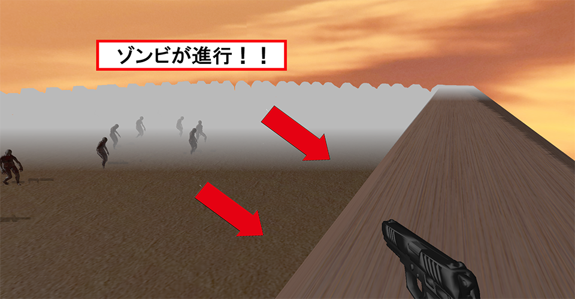
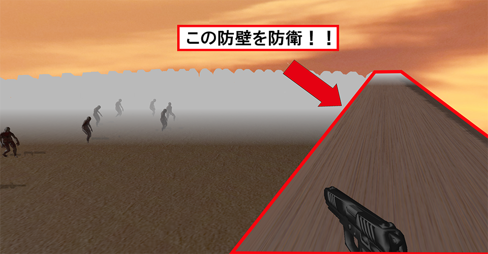
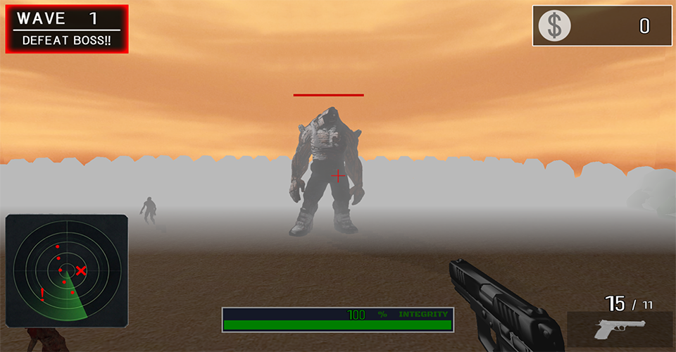
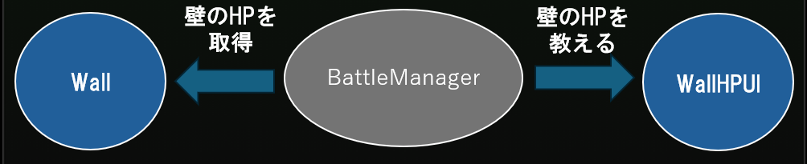
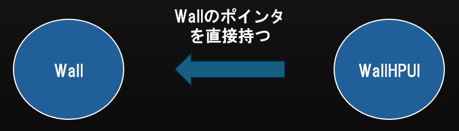
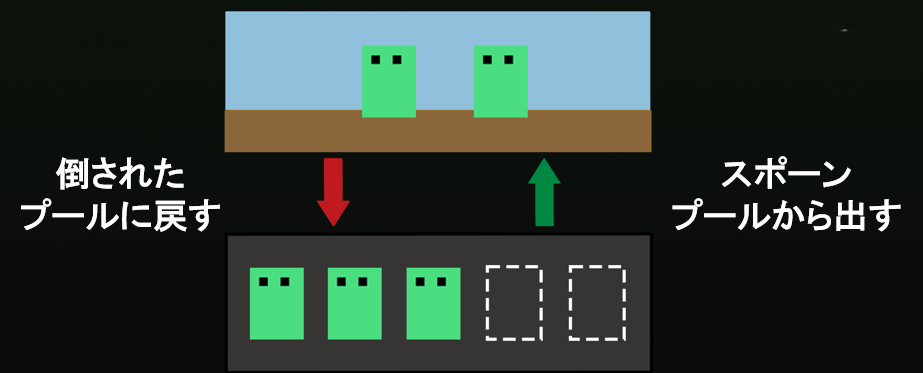
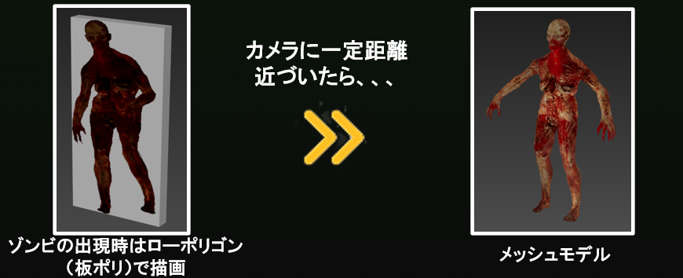
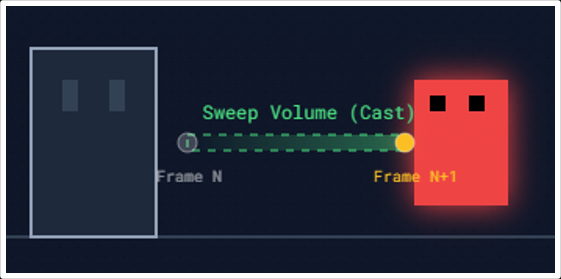
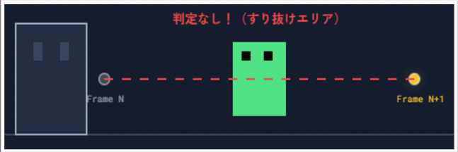

<link rel="stylesheet" href="style.css">
# 「Grave Wave」　ポートフォリオ


## <font color="#ff0000">概要紹介</font>


### <font color="#ff0000">作品概要</font>
---


- <font color="#ffff00">ゲームタイトル</font>
　　　　　　Grave Wave

- <font color="#ffff00">ゲームジャンル</font>
　　　　　　FPSタワーディフェンス

- <font color="#ffff00">プレイ人数</font>
　　　　　　1人

- <font color="#ffff00">開発期間</font>
　　　　　　４か月


### <font color="#ff0000">開発環境</font>
---

- <font color="#ffff00">使用言語</font>
　　　　　　C++（C++14）

- <font color="#ffff00">使用エンジン</font>
　　　　　　学内エンジン（DirectX12）

- <font color="#ffff00">プラットフォーム</font>
　　　　　　Windows11

- <font color="#ffff00">使用ツール</font>
　　　　　　Visual Studio 2022,GitHub


## <font color="#ff0000">ゲーム内容紹介</font>


### <font color="#ff0000">ゲームの流れ</font>
---



荒野の奥から大量のゾンビが迫ってくる！！
<br>
<br>




銃でゾンビを撃退！！
<br>
<br>




最終ウェーブのボスを撃破すると、ゲームクリア！！！
<br>
<br>


## <font color="#ff0000">技術紹介</font>


### <font color="#ff0000">疎結合化</font>
---
モジュール間の疎結合化を意識してクラス設計を行った。


**<font color="#ffff00">実装方法</font>



モジュールが他のモジュールを直接知らなくても実装できるような形で実装進め、
他の管理クラスが必要となる情報だけを教えるなど、「必要最低限のことしか教えない設計」で実装を行った。
１か箇所の変更で他クラスに影響することがなくなり、保守性、拡張性の高い設計にすることができた。


<font color="#ffff00">実装の意図</font>



過去のゲーム制作では、結合度をあまり意識せず、モジュール間の繋がりが強い状態で実装を進めていた。
その結果、一つの変更が他に影響してしまう結果に。デバッグや新規実装が非効率なものとなってしまった。
今回の制作では、長期的な開発効率を意識した実装を行った。
「今だけのコード」ではなく、「後々見返したときに修正、拡張がしやすいか」を始めから意識するように心がけた。


### <font color="#ff0000">オブジェクトプール</font>
---
ゾンビのスポーンをオブジェクトプールにて行った。

<font color="#ffff00">実装方法</font>



↑オブジェクトプール実装イメージ↑

実装の流れは以下の通り

1. インゲームに入る際、そのゲーム中で出現するであろうゾンビの最大数をあらかじめ生成。
2. インゲーム中は生成削除を行わず、プールとフィールドを行き来させる。

この実装方法では、インゲーム中にゾンビの生成削除を行わない。
そのため、ゲーム中はCPUへの負荷を安定させ、フレームレートを一定に保てるだけでなく、
メモリの断片化を防ぎ、メモリ不足に陥るリスクを抑えることもできた。


<font color="#ffff00">実装の意図</font>


↑new、deleteの瞬間にメモリ使用量が多くなっている様子（イメージ）↑
<br>


↑メモリの断片化（イメージ）↑
<br>


実装前はゲーム中にゾンビの生成と削除を繰り返していた。
その結果、生成、削除の瞬間だけ、フレームレートが著しく低下し、ユーザー体験を損ねてしまっていた。
また、メモリの断片化が起き、動作環境によってはメモリ不足に陥ってしまう可能性があった。


### <font color="#ff0000">LOD</font>
---
ゾンビの描画処理にLOD処理を加えた。


==<font color="#ffff00">実装方法</font>==



↑LODの実装イメージ↑
<br>
<br>

実装手順は以下の通り

1. ゾンビのスポーン時はLOWモデル（板ポリ）で描画。
2. カメラとゾンビとの距離が一定距離になったら、、、
3. 通常のメッシュモデルに切り替える。

この実装手段を取ることで、インゲーム中のGPUへの負荷を一定に保つことができた。
ユーザーからの見た目を一定に保ちつつ、フレームレートの低下を抑えることができた。


↑LODを実装する前の実行画面の様子↑
<br>
<br>


↑LODを実装した後の実行画面の様子↑
<br>
<br>

<font color="#ffff00">実装の意図</font>

対策を施さずにゾンビを大量生成すると、GPUへの負荷が高くなってしまった。
その結果、フレームレートの低下が目立つ結果となり、プレイ体験を損ねてしまっていた。
また、動作環境によっては少ない生成数でも負荷がかかってしまうと考えた。

<br>

### <font color="#ff0000">衝突判定</font>
---
弾丸と目標物との当たり判定をSweepTestを用いて行った。

<font color="#ffff00">実装方法</font>



↑SweepTestで処理を行い、衝突判定が安定した図（イメージ）↑

<br>

SweepTestの処理手順は以下の通り
（学内エンジンで簡易的に使用できるようにはされている）

1. 弾丸の現在位置（始点）を取得する。
2. 弾丸の次のフレームに移動する位置（終点）を計算する。（移動ベクトル　×　移動速度）
3. 始点から終点までの大きさのコリジョンを置く。（指定した太さで）
4. コリジョンにヒットしたものがある場合trueを返す。

この手段を取ることで、弾の速さ、大きさに関わらず、衝突判定を取ることができた。


また、SweepTestを用いるにあたって、内部では多くのゲームでも使用されているBulletPhysicsを使用している。
だが、そのままの状態では「衝突判定」はとれるものの、「何に衝突したか」は取得できないものとなっている。
「どの弾が、どのゾンビに衝突したか」という対象物の情報が取れるような改造を施した。


修正箇所は以下の通り

```cpp
btScalar addSingleResult(btCollisionWorld::LocalConvexResult& convexResult, bool normalInWorldSpace) override
{
    //自分自身を弾く
    if (&m_me->GetbtCollisionObject() == convexResult.m_hitCollisionObject) return 0.0f;
    //エネミー以外かつゴーストオブジェクトではない時
    if (convexResult.m_hitCollisionObject->getUserIndex() != nsApp::enCollirionEnemy
        && convexResult.m_hitCollisionObject->getInternalType() != btCollisionObject::CO_GHOST_OBJECT) {
        return 0.0f;
    }
    isHit = true;
    m_you = convexResult.m_hitCollisionObject;
    return 0.0f;
```

<br>

<font color="#ffff00">実装の意図</font>



↑実装前に弾の当たり判定が安定しなかった図（イメージ）↑

<br>

コリジョンだけののシンプルな衝突判定では、フレームごとのコリジョンの位置でしか判定を取ることができない。
そのため、弾の速さ、大きさによっては目標物を飛び越えてしまい、安定した判定を取得できなかった。
弾のステータスに関わらず、安定した判定を取れ、弾の太さも考慮したSweepTestを用いることで、プレイ体験はそのままに、安定した判定を取得できるようになるのではと考えた。


### <font color="#ff0000">その他の技術紹介</font>
---
#### <font color="#ffff00">データ駆動</font>

数値調整時のイテレーション速度の向上のため、
「ゾンビのHP」「弾の速さ」といった情報をjsonファイルにて調整できるようにした。

ゲーム起動時に情報を外部から読み込むようにすることで、
数値調整を施しても、ビルドをする必要がなくなった。

```json
"Comment": "ゾンビ用のパラメータ",
"MoveSpeed":0.3,
"HP":10,
"AttackPower":3,
"AttackFrequency":3.0,
"AttackRange":50.0
```
↑ゾンビのステータスを記載したjsonファイル↑

<br>

#### <font color="#ffff00">ステートパターン</font>

エネミーなどのキャラクターの状態ごとの処理を分離し、実装、デバッグをしやすくするため、
ステートパターンで状態遷移、及び状態ごとの処理を行った。

実装することで、状態の処理が分離され、一クラスごとの責任を分散することができた。
状態ごとの処理が干渉しにくくなり、保守性、拡張性が高い実装になった。


```cpp
void StateMachine::Update()
{
    if (m_currentStateId != m_requestStateId)
    {
        IState* nextState = FindState(m_requestStateId);
        K2_ASSERT(nextState, "次の状態が見つからない");
        if (nextState) {
            if (m_currentState) {
                m_currentState->Exit();
            }
            nextState->Enter();
            m_currentState = nextState;
        }
        m_currentStateId = m_requestStateId;
    }
    if (m_currentState) {
        m_currentState->Update();
    }
}
```
↑StateMachineでの、各Stateへの遷移の処理↑

```cpp
void ZombieDeathState::Enter()
{
    auto* owner = GetOwner<ZombieStateMachine>()->GetOwner();
    owner->GetModel()->PlayAnimation(Zombie::EnAnimationVar_Death);
}

void ZombieDeathState::Update()
{
    auto* owner = GetOwner<ZombieStateMachine>()->GetOwner();

    //一定時間後にプールに戻す
    m_currentTime += g_gameTime->GetFrameDeltaTime();
    if (m_currentTime >= RESTORE_TIME) owner->SetRestore(true);
}

void ZombieDeathState::Exit()
{
}
```
↑DeathState時の処理↑

<br>

#### <font color="#ffff00">シングルトンパターン</font>

管理クラスが複数生成されることによって発生する、不具合の抑制、
及び、管理クラスへのアクセスの簡略化を目的に、
シングルトンパターンを用いて、管理クラスの生成を行った。

管理クラスの唯一性を保つことができ、クラスが複数を生成されてしまうリスクを防ぐだけでなく、
グローバルアクセスになるため、各クラスが管理クラスへとアクセスできなくなる。
（かといって、多くのクラスが管理クラスを知らなくてもいいようなクラス設計をしている）

```cpp
private:
    /** 自身のインスタンス */
    static BattleManager* m_instance;

public:
    /** BattleManagerクラスのインスタンスを作成 */
    static void CreateInstance()
    {
        if (!m_instance) m_instance = new BattleManager();
    }
    /** BattleManagerクラスのインスタンスを削除 */
    static void DeleteInstance()
    {
        if (m_instance) {
            delete m_instance;
            m_instance = nullptr;
        }
    }
    /** BattleManagerクラスのインスタンスを取得 */
    static BattleManager* GetInstance() { return m_instance; }
```
↑管理クラスのヘッダーファイルの一部↑


## <font color="#ff0000">今後の展望</font>

#### <font color="#ffff00">さらなるデータ駆動設計</font>

イテレーション速度上げていき、さらなる開発の効率化へ！！
今後は数値だけではなく、「行動パターン」や「オブジェクトの配置」なども調整できるようにしたいと考えている。
（オブジェクト配置は外部GUIツールを用いて視覚的に行えるように）

<br>

#### <font color="#ffff00">メモリアロケーター</font>

今回のオブジェクトプール実装に伴い、メモリ管理を意識するようになった。
だが、すべてのオブジェクトのnewなどでは活用できていない。
今後はメモリアロケーターを自身で作成して、自身でメモリ管理を行い、
メモリへの理解をさらに深めていきたい。